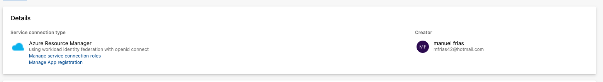
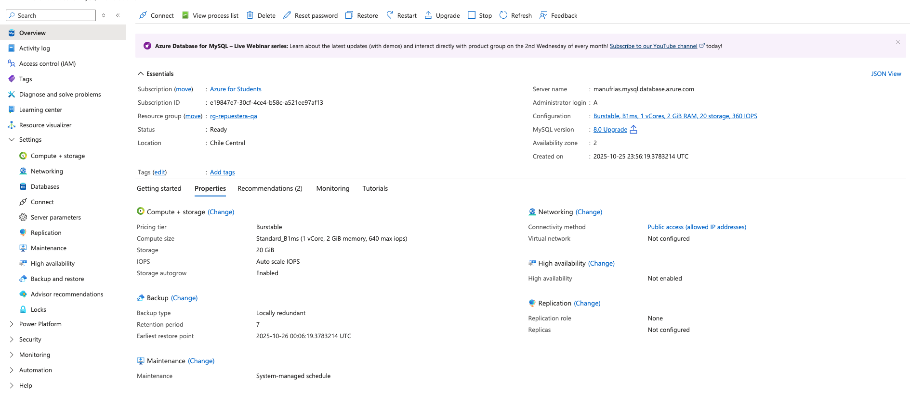
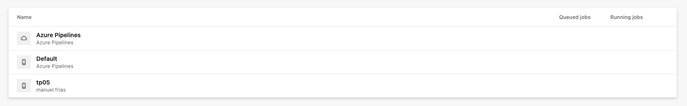
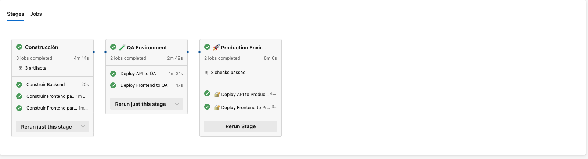

# Decisiones de Despliegue Azure - Proyecto Repuestera

---

## 1. Carga del Repositorio Remoto en Azure

**Decisión**: Conectar el repositorio local con Azure DevOps.

**Justificación**:
- Integración nativa con servicios de Azure
- Pipelines automáticos al hacer push
- Control de versiones en la nube
- Incluido en la suscripción de Azure for Students

---

## 2. Creación de Recursos Necesarios

**Decisión**: Crear App Services separados para frontend y backend.

**Justificación**:
- Separación de responsabilidades
- Escalado independiente
- Configuración específica por servicio
- Uso del plan gratuito

**Recursos creados**:
- Resource Group único para todos los recursos
- App Service Plan compartido
- App Services para frontend y backend

---

## 3. Carga de Base de Datos en Flexible Server

**Decisión**: Migrar de SQL local a Azure Database for MySQL Flexible Server.

**Justificación**:
- Servicio administrado por Azure
- Alta disponibilidad y escalabilidad
- Seguridad integrada con firewall de Azure

**Configuración**:
- Firewall de Azure configurado
- Reglas de acceso para App Services
- Scripts de migración de datos

---

## 4. Desarrollo del Pipeline YAML

**Decisión**: Crear pipeline básico con una sola etapa inicialmente.

**Justificación**:
- Validar funcionamiento básico
- Identificar problemas antes de agregar complejidad
- Establecer base sólida para expansión

**Estructura**:
- Etapas separadas de build y deploy
- Variables de entorno por ambiente
- Configuración específica para Azure

---

## 5. Pruebas del Pipeline

**Decisión**: Probar el pipeline con despliegue a un solo ambiente.

**Justificación**:
- Verificar funcionamiento correcto
- Identificar y resolver problemas
- Establecer confianza antes de expandir

**Problemas resueltos**:
- Configuración de CORS
- Variables de entorno
- Conexión a base de datos
- Timeouts de pipeline

---

## 6. Modificación para Dos Ambientes

**Decisión**: Separar en ambientes QA y Producción.

**Justificación**:
- Aislamiento entre desarrollo y producción
- Ambiente dedicado para testing
- Configuración independiente por ambiente

**Implementación**:
- App Services separados con URLs únicas
- Variables de entorno específicas
- Recursos independientes por ambiente

---

## 7. Pruebas de Ambientes Separados

**Decisión**: Validar exhaustivamente ambos ambientes.

**Justificación**:
- Confirmar funcionamiento en QA
- Verificar producción después de QA
- Identificar diferencias entre ambientes

**Validaciones**:
- Funcionalidad completa en QA
- Funcionalidad completa en Producción
- Configuración correcta de variables

---

## 8. Aprobación Manual para Producción

**Decisión**: Requerir aprobación manual antes de desplegar a producción.

**Justificación**:
- Control de calidad antes de cambios en producción
- Prevención de despliegues accidentales
- Responsabilidad clara de aprobaciones

**Configuración**:
- Administradores del proyecto como aprobadores
- Proceso de aprobación en Azure DevOps
- Registro de aprobaciones

---

## 9. Resolución de Errores

**Decisión**: Implementar proceso sistemático para resolver problemas.

**Justificación**:
- Mantener estabilidad del sistema
- Aprender de problemas encontrados

**Problemas resueltos**:
- Errores de conexión a base de datos
- Problemas de autenticación
- Configuración de CORS
- Timeouts de pipeline

---

## 10. Resultado Final

**Resultado**: Pipeline completo funcionando en Azure.

**Componentes finales**:
- Azure DevOps Pipeline con CI/CD
- Azure App Services para frontend y backend
- Azure MySQL Flexible Server para base de datos
- Ambientes QA y Producción separados
- Aprobaciones manuales para producción
